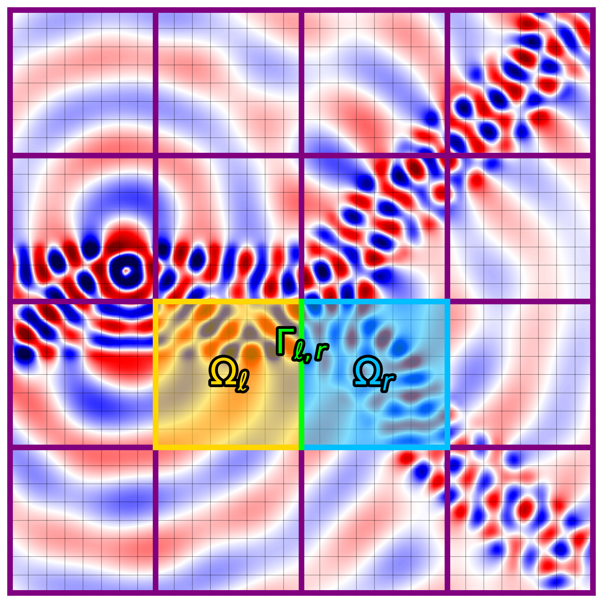

# CuDDHelmholtz
CUDA implementation of parallel domain decomposition methods for preconditioning iterative solvers to the Helmholtz equation.

We consider the Helmholtz equation with zero-order absorbing boundary conditions:

$$-\Delta u - k^2 u = f, \qquad \forall x\in\Omega,$$

$$\frac{\partial u}{\partial \mathbf{n}} - i k u = 0, \qquad \forall x\in\partial\Omega.$$

Here $\Omega$ is an open and simply connected subset of $\mathbb{R}^d$ ($d = 2,3$), $k = \omega/c(x)$ where $\omega$ is the frequency, $c$ is the wavespeed, and $f$ is a function.
We solve the Helmholtz equation via the spectral element method.
The weak formulation is for all $\phi\in H^1(\Omega)$

$$\begin{align*}
(\nabla u, \nabla \phi) - \omega^2 (c^{-2} u, \phi) - i\omega \langle c^{-1} u,\phi \rangle &= (f,\phi), 
\end{align*}$$

Here
$$(f, g) = \int_\Omega f g \\, dx, \qquad \langle f, g \rangle = \int_{\partial\Omega} f g \\, ds.$$

Let $\\{\phi_i\\}_{i=1}^n$ be the SEM basis functions, and define the matrices

$$S_{ij} = (\nabla \phi_i, \nabla \phi_j), \quad M_{ij} = (\alpha\phi_i, \phi_j), \quad H_{ij} = \langle \phi_i, \phi_j \rangle.$$

Let $b_i = (f, \phi_i)$. After discretization by the SEM

$$(S - i\omega H - \omega^2 M) u =  b.$$

In this repo are three main solvers for this linear system on GPUs: MINRES, WaveHoltz + Krylov, Domain Decomposition (DD) + Krylov. Krylov space methods are known to converge slowly for the Helmholtz equation because of its indefinite nature, and the MINRES solver indeed highlights this. The WaveHoltz and DD methods are fixed point iteration methods which can be accelerated by Krylov space methods. The accelerated iterations can be interpretted as preconditioners for the Krylov methods.

The domain decomposition method splits the domain into (many) subdomains and solver a relate Helmholtz problem on each subdomain. Here, the subdomain problems are solved with WaveHoltz.

